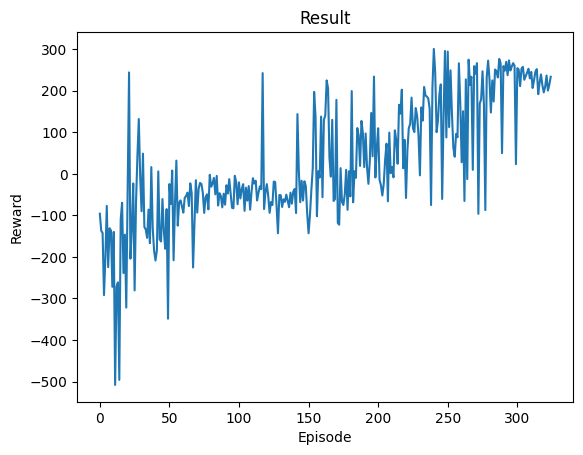
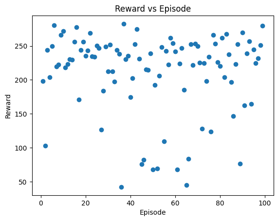

# DQN LunarLander

This project implements a **Deep Q-Network (DQN)** agent to solve the **LunarLander-v3** environment using PyTorch and Gymnasium. The goal is to control a lunar lander as it navigates through a gravity-influenced environment to safely land between designated flags.

## Project Overview
This repository contains a DQN agent for the LunarLander environment. The agent:
- Uses a fully connected neural network to approximate the Q-value function.
- Trains using experience replay and soft updates to the target network.
- Is evaluated on various episodes of the LunarLander-v3 environment, displaying the agent's ability to learn and maximize rewards over time.

Key components include:
- **Replay Memory**: Stores past transitions `(state, action, reward, next_state)` for experience replay.
- **Target Network**: A network with weights that are periodically updated to stabilize learning.
- **Policy Network**: The main Q-network that learns optimal actions through backpropagation.

## Requirements
To run the project, the following libraries are required:

- `numpy`
- `pandas`
- `gymnasium`
- `matplotlib`
- `torch`
- `swig`
- `gymnasium[box2d]`

## DQN Model Overview
The DQN model architecture consists of:
- **Input Layer**: Takes in the current state (observations) from the environment.
- **Hidden Layers**: Three hidden layers with 256, 128, and 128 neurons respectively, followed by ReLU activation functions.
- **Output Layer**: Outputs Q-values for each action in the action space.

The model is trained using:
- **Loss Function**: Mean squared error (MSE) between predicted and target Q-values.
- **Optimizer**: AdamW optimizer with amsgrad enabled for better convergence.

## Training Process
1. **Action Selection**: The agent selects actions using an epsilon-greedy strategy to balance exploration and exploitation.
2. **Experience Replay**: Experiences are stored in a replay memory and sampled in batches for training.
3. **Q-value Updates**: The policy network's Q-values are updated by minimizing the loss between predicted and expected Q-values using Bellman’s equation.
4. **Target Network**: The target network is updated using soft updates to ensure stable learning.

### Key Hyperparameters:
- Batch Size: `128`
- Gamma (Discount Factor): `0.99`
- Epsilon Decay: `1000`
- Learning Rate: `1e-4`
- Target Network Update Rate (Tau): `0.005`

## Results
The training and evaluation process is tracked using episode rewards. Below is a typical result showing the agent's rewards over multiple episodes:
During training:
 
<!-- Insert actual image if available -->
During evaluation:
 

During the evaluation phase, the agent selects actions greedily (without exploration) and the cumulative reward is recorded for each episode.

